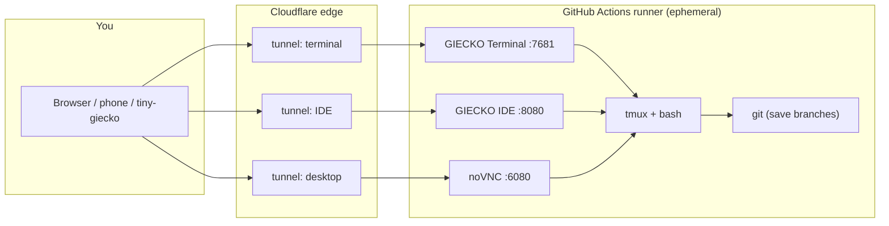

# Architecture

> One workflow run = one machine = one session. Everything else is
> plumbing to make that machine reachable and pleasant.

## The big picture

## The boot sequence

1. **workflow dispatch or push** — `giecko.yml` starts one job on the
   runner OS you picked
2. **checkout** — the repo (with all Giecko files) lands on the runner
3. **downloads** — cloudflared, GIECKO Terminal, GIECKO IDE, trzsz,
   fetched in parallel. Ours first, upstream as fallback
4. **packages** — tmux, jq, tree, htop, fastfetch, qrencode, plus your
   extras; `clangd` when the IDE stack runs
5. **services** — ttyd and code-server bind to `127.0.0.1` only
6. **tunnels** — one cloudflared quick tunnel per service, each with its
   random `trycloudflare.com` name (or one named tunnel for your domain)
7. **env** — `~/.giecko.env` (or `/etc/giecko.env`, or
   `$GIECKO_CONFIG_DIR/giecko.env`) gets every fact the session needs
8. **heartbeat** — the job sleeps, publishes status reports, autosaves
   your workspace every N minutes, until the duration runs out
9. **shutdown** — final save, final report, runner dies, disk is wiped

## Ports and processes

| Service | Port | Process |
|---|---|---|
| GIECKO Terminal | 7681 | `ttyd` (our build) over tmux |
| GIECKO IDE | 8080 | `code-server` (our build) |
| Desktop web | 6080 | noVNC websockify |
| Desktop VNC | 5900 | TightVNC / macOS VNC / Xvfb+X11VNC |

Only the tunnels are public; all services bind to loopback.

## Where your data lives

| Data | Where | Survives the run? |
|---|---|---|
| Workspace files | `$HOME` on the runner | only via `giecko save` branches |
| Dotfiles and config | `$HOME` on the runner | only with [persistent home](Persistence.md) |
| Session record | your laptop, `~/.config/giecko/sessions/<run-id>/` | yes |
| URLs | published in the run summary + annotations | until the run log expires |

## Components

| Piece | Origin | Notes |
|---|---|---|
| GIECKO Terminal | fork of ttyd 1.7.7 | static libwebsockets, our UI and favicon |
| GIECKO IDE | repacked code-server 4.139.1 (VS Code 1.139.1) | our branding, no Copilot, 34 extensions |
| cloudflared | upstream | quick tunnels or named tunnels |
| tmux | apt/brew | session persistence across tab crashes |
| trzsz | pip | drag-and-drop file transfer |
| noVNC + XFCE | apt | desktop stack on linux |

## Limits, by design

- **6 hours max** — GitHub's job cap; the duration input is capped there
- **No inbound** — the runner can't accept direct connections; tunnels only
- **One session per run** — rooms share one runner (see [Rooms](Rooms.md))
- **Ephemeral disk** — the moment the job ends, everything is wiped

---

← [Getting Started](Getting-Started.md) · [Stacks](Stacks.md) →
