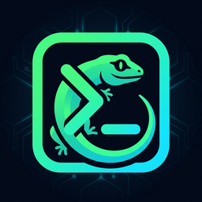

  

<h1 align="center">GIECKO</h1>

  
  
  
  

  <b>Turn GitHub Actions into a browser-accessible dev environment.</b> 
  A terminal, a full IDE, or an entire desktop OS — booted from a workflow, 
  reachable from any browser, gone when you are done.

---

## What you get

| Stack | What it is | Best for |
|---|---|---|
|  **Terminal** | GIECKO Terminal — our remade ttyd, in tmux | quick shell work, servers, one-liners |
|  **IDE** | GIECKO IDE — our remade code-server, terminal included | real coding sessions |
|  **VS Code** | IDE without the terminal tab | focused editing |
|  **Desktop** | XFCE + noVNC — the whole GUI OS in the browser | GUI apps, browsers, experiments |

Every session gets public HTTPS URLs (random `trycloudflare.com` or your own
domain), QR codes for phones, login passwords, autosave of your work to git
branches, and a `giecko` CLI inside the session.

## Start here

| Path | How | Where |
|---|---|---|
|  No install | Actions → *Giecko Terminal* → Run workflow | [Getting Started](Getting-Started.md) |
|  npm CLI | `npm install -g giecko` | [CLI Reference](CLI-Reference.md) |
|  Phone | APK from the releases page | [Mobile App](Mobile-App.md) |
|  No browser | native C99 client | [tiny-giecko](tiny-giecko.md) |

## The wiki

**Basics** — [Getting Started](Getting-Started.md) · [Architecture](Architecture.md) · [Stacks](Stacks.md) · [Distros & OS](Distros.md) · [Networking](Networking.md)

**The apps** — [GIECKO IDE](GIECKO-IDE.md) · [GIECKO Terminal](GIECKO-Terminal.md) · [Desktop Mode](Desktop-Mode.md) · [Mobile App](Mobile-App.md) · [tiny-giecko](tiny-giecko.md)

**Working inside** — [Session Commands](Session-Commands.md) · [Rooms](Rooms.md) · [Persistence](Persistence.md) · [File Transfer](File-Transfer.md)

**Control from outside** — [CLI Reference](CLI-Reference.md) · [Configuration](Configuration.md) · [Workflow Inputs](Workflow-Inputs.md) · [Commit Triggers](Commit-Triggers.md)

**Under the hood** — [Security](Security.md) · [Releases](Releases.md) · [Development](Development.md)

**Help** — [Troubleshooting](Troubleshooting.md) · [FAQ](FAQ.md)

## The honest pitch

- It is free (public repos get free runners and Cloudflare tunnels)
- It is ephemeral (max ~6h, disk wiped, URLs change every run)
- It is public by URL (set a password, always)
- It is not a VPS (see [TERMS](../TERMS.md) and [Security](Security.md))

---

[Getting Started](Getting-Started.md) is three minutes away.
