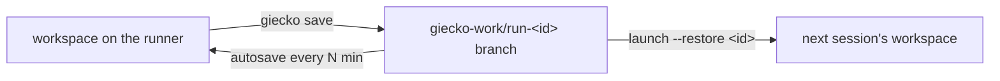

#  Persistence

> The runner dies (max 6h), the disk is wiped. Three systems keep what
> matters: save branches, autosave, and the opt-in persistent home.

## 1. Save branches (your work)

- `giecko save` (or the `save` alias, or the IDE panel) snapshots the
  workspace to the `giecko-work/run-<id>` branch
- Every run gets its own branch — nothing overwrites
- `giecko ls` (on your laptop) lists runs and their save branches
- Restore: `giecko launch --restore <run-id>` or the `restore` workflow
  input

## 2. Autosave

| Setting | Default | Effect |
|---|---|---|
| `autosave_minutes` input / `--autosave` | 15 | snapshot every N minutes |
| `0` | — | off |

A final save always runs at shutdown (unless the runner is killed
hard). Autosave is git-based, so only changed files cost anything.

## 3. Persistent home (opt-in, dotfiles and config)

The workspace save covers project files. Your **home identity** —
dotfiles, `.gitconfig`, `.ssh`, `.config`, `.vim`, tmux config — can
come along too:

| Step | What happens |
|---|---|
| launch | tick `persist_home` (workflow input, arg 9 to `giecko.sh`) |
| boot | the `giecko-home` branch is cloned and extracted into `$HOME` |
| start | a snapshot is pushed back after boot |
| shutdown | a final snapshot is pushed |

Facts:

- the tarball is capped at **25 MB** — big dirs are skipped with a note
- every snapshot is also tagged `home-run-<id>` (history you can dig
  through)
- it is opt-in for a reason: your `.ssh` keys land in a **private
  branch of the session repo** — use a throwaway key, or leave it off
- `giecko persist` inside a session explains the current state

## What is NOT persisted

| Thing | Why |
|---|---|
| installed apt/npm packages | reinstalled from the `packages` input each boot |
| IDE extensions from Open VSX | the 34 bundled ones always return; extras need persistent home |
| URLs | new every run (see [Networking](Networking.md)) |
| running processes | runners do not survive |

## Rules of thumb

- Real work → **git anyway**; `giecko save` is the convenience layer
- Dotfiles across sessions → persistent home, with a throwaway ssh key
- Demos and experiments → autosave 15 is plenty

---

← [Rooms](Rooms.md) · [File Transfer](File-Transfer.md) →
