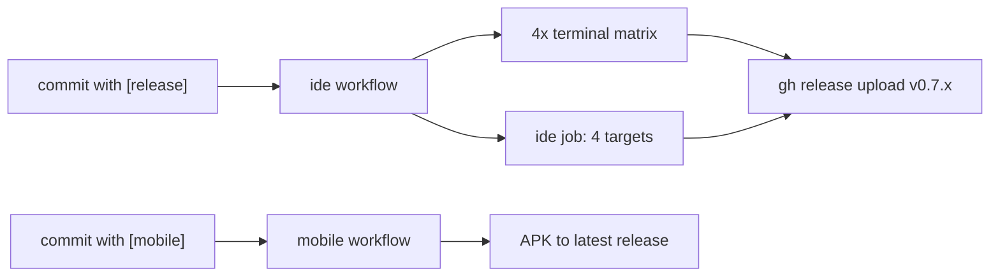

# Releases


> Versioned bundles attached to GitHub releases — what ships in each
> one, and how they get there.

## v0.7.0 contents

| Asset | Size | What it is |
|---|---|---|
| `giecko-ide-0.7.0-linux-amd64.tar.gz` | ~570 MB | GIECKO IDE, x86_64 linux |
| `giecko-ide-0.7.0-linux-arm64.tar.gz` | ~566 MB | GIECKO IDE, arm64 linux |
| `giecko-ide-0.7.0-macos-amd64.tar.gz` | ~568 MB | GIECKO IDE, intel mac |
| `giecko-ide-0.7.0-macos-arm64.tar.gz` | ~553 MB | GIECKO IDE, apple silicon |
| `giecko-ide-0.7.0.vsix` | 32 KB | the GIECKO extension, standalone |
| `giecko-terminal-x86_64` | ~431 KB | GIECKO Terminal, linux x86_64 |
| `giecko-terminal-aarch64` | ~480 KB | linux arm64 |
| `giecko-terminal-darwin-amd64` | ~355 KB | intel mac |
| `giecko-terminal-darwin-arm64` | ~375 KB | apple silicon |
| `giecko-v0.7.0-android.apk` | ~68 MB | the mobile app |

IDE bundles are big on purpose: VS Code 1.139.1 + 34 extensions,
preinstalled and verified (no gallery round-trips at session boot —
the IDE is usable the second it opens).

## How a release is made



1. A `[release]` commit lands (touching `ide/` or `giecko-terminal/`)
2. The `ide` workflow builds the terminal matrix (native runners per
   arch) and the IDE bundles (one runner, all four targets)
3. The release job creates-or-reuses `v<version>` and uploads with
   `--clobber` — re-running a release refreshes the assets
4. The version comes from `ide/build-ide.sh` (`GIECKO_IDE_VERSION`)
5. `[mobile]` attaches the APK to the latest release

Manual dispatch also works from the Actions tab (same workflow,
`upload_release` input) if you have dispatch permissions.

## What sessions download

At boot, sessions try **our release first** —
`GIECKO Terminal installed (ours)`, `GIECKO IDE installed (ours, 0.7.0)`
— and fall back to upstream code-server / brew when the release is
unreachable (older fork, network hiccup, windows runners).

## npm

The CLI on npm is published **manually** — by a human, from the `cli/`
directory, after testing:

```bash
cd cli && npm publish
```

There is no npm workflow in the repository, by decision. The CLI
version and changelog live in `cli/package.json` /
`cli/CHANGELOG.md`.

## Versioning

- `0.x` — everything moves together (CLI, session files, IDE) while
  the project is young
- the release tag matches the IDE/CLI version (`v0.7.0`)
- session files in a repo update themselves on `giecko launch`
  (unless `--nr`)

---

← [Commit Triggers](Commit-Triggers.md) · [Development](Development.md) →
